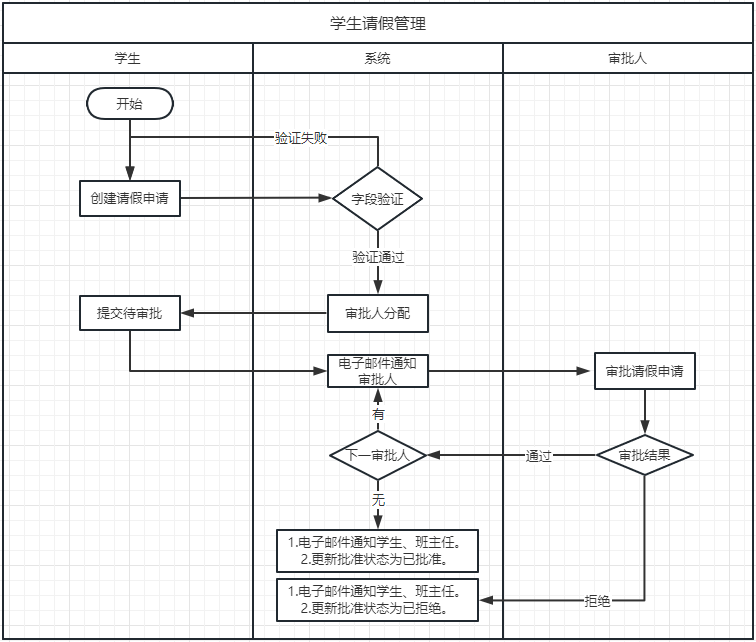
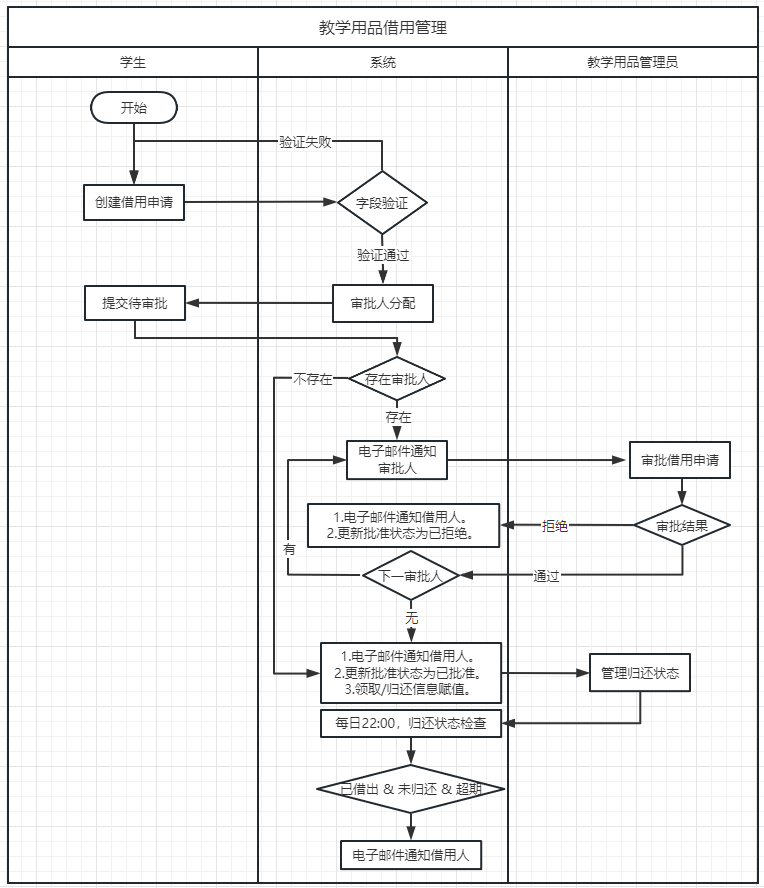
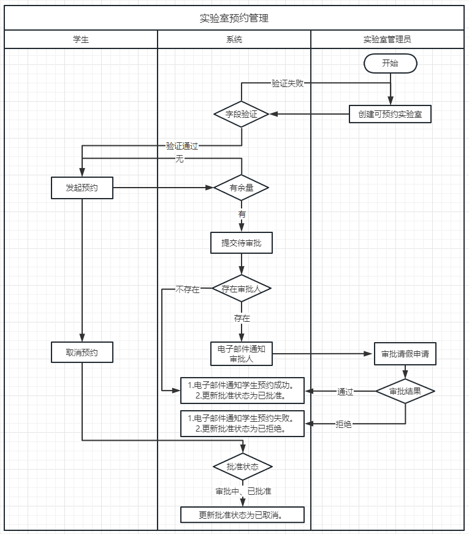
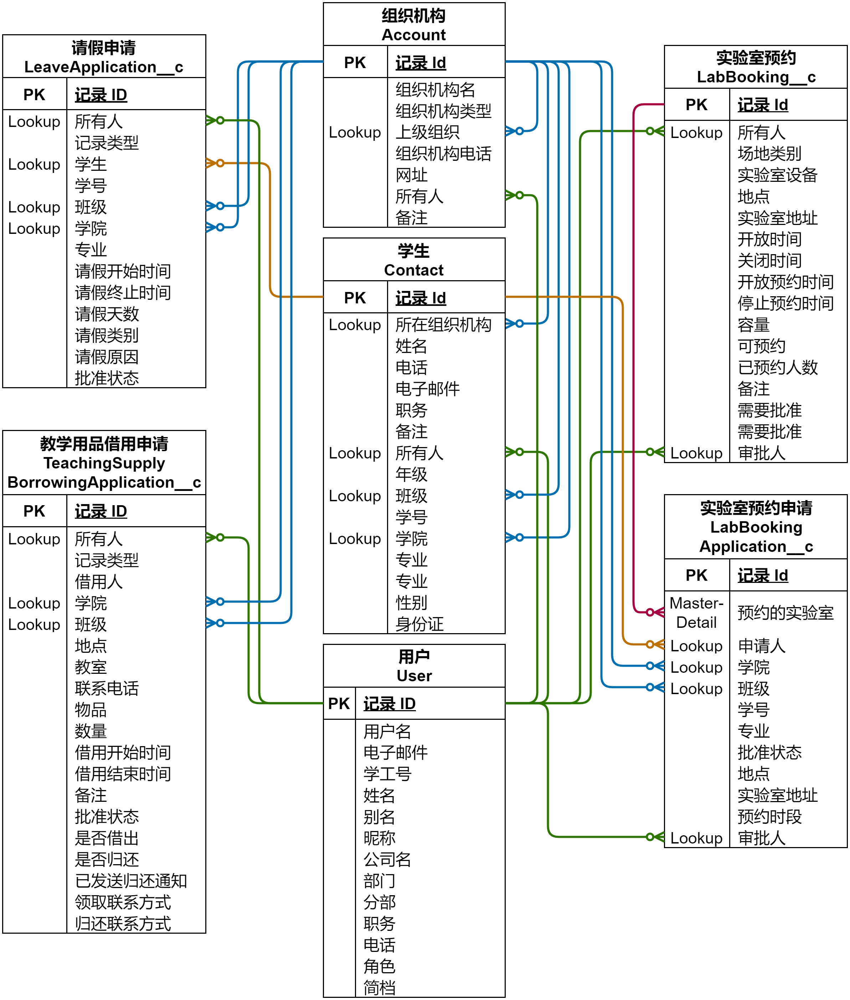
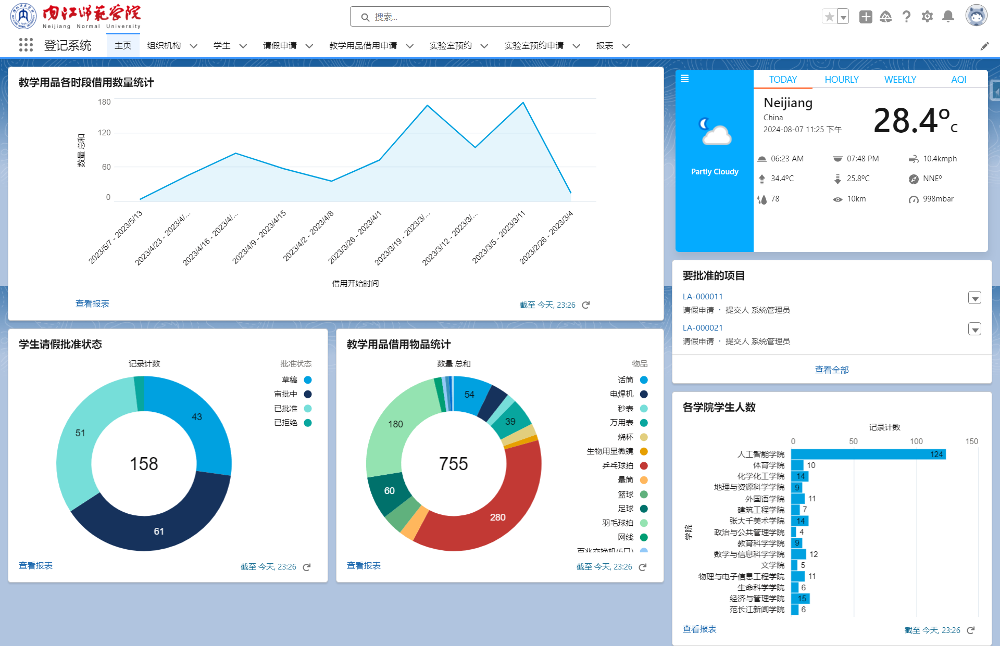
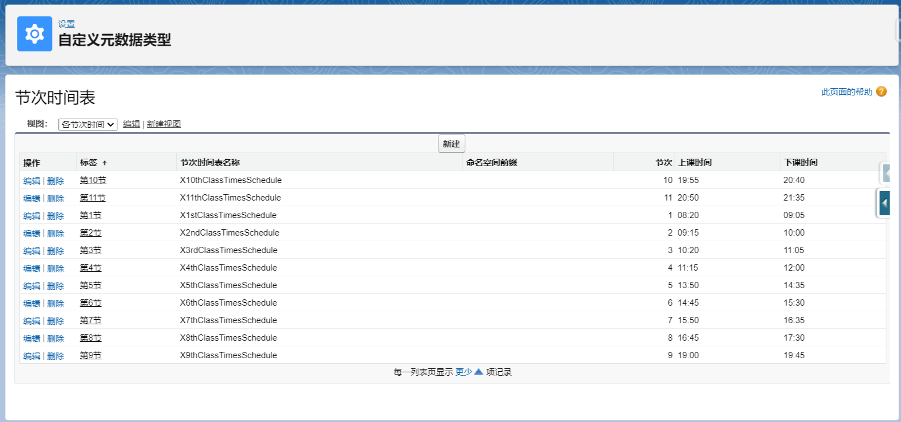
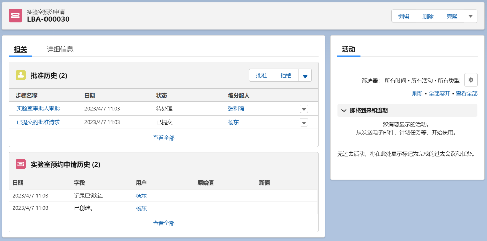
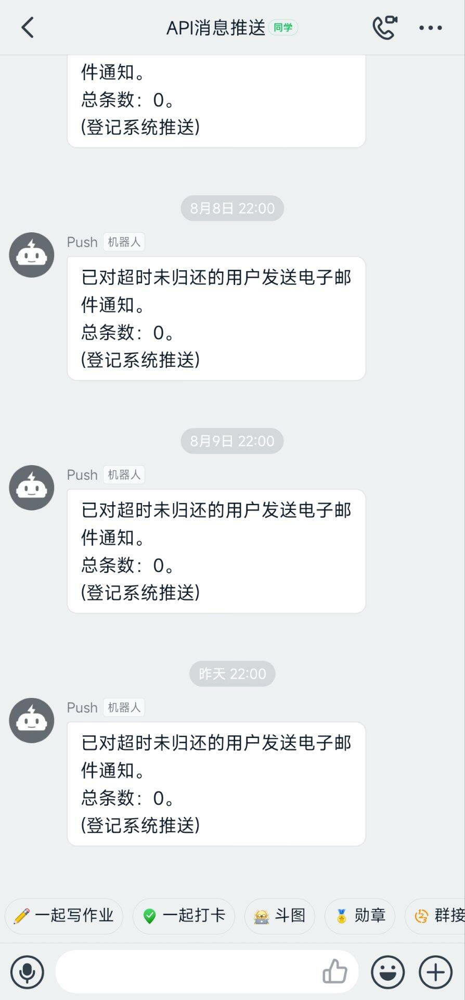
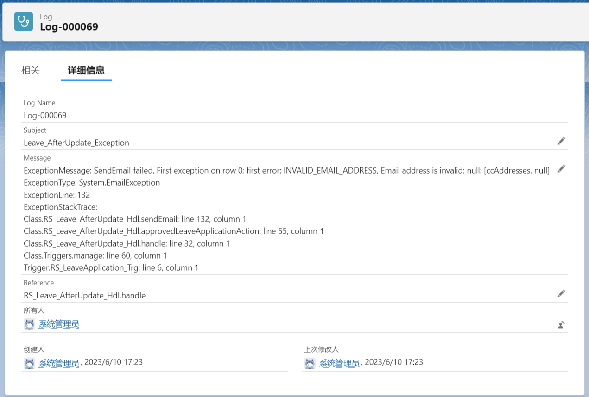
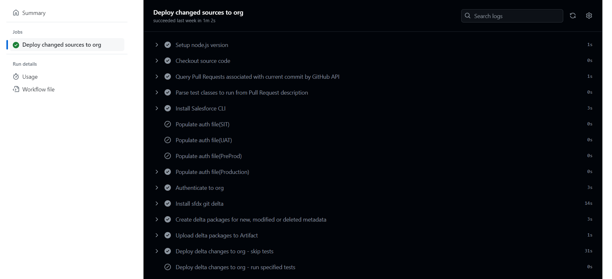

# 基于Salesforce的校园登记审批系统

## 前言

本项目作为我的本科毕业设计，使用 Salesforce Developer Org，运用标准功能和前后端开发技术，独立开发了一套校园登记审批系统，旨在为师生双方提供人性化、高效率、低成本的登记审批流程。

本项目由校内教职工使用的 Lightning Experience 和校内学生使用的 Experience Cloud组成。

该系统历经半年时间实现，其中有两个月的Full-time开发时间。该系统有组织机构管理、学生管理、学生请假、教学用品借用、实验室预约五个功能模块，综合运用了 Profile、Record Type、Page Layout、Validation Rule、List View、Approval Process、Email Template、Org-Wide Email Address、Custom Metadata Type、Remote Site Settings、Report 等标准功能，以及 LWC、Apex、Trigger、SOQL、HTTP Callout 等前后端开发技术，对整个系统的主数据结构、业务流程、数据的创建与展示、电子邮件推送、钉钉消息推送、批准过程、权限控制等功能进行了实现，让学生事务管理走向数字化。

本项目虽然系统架构、业务流程较为简单，与我工作后参与的项目经历相比略显青涩，但这段独立实现系统功能的经历，大大提升了我对 Salesforce 系统的理解，系统配置、数据库表设计、编码开发的能力都得到了显著提升，被学校评为优秀毕业设计，之后我很快正式融入到了真实的商业项目当中。

## 系统演示与体验

本项目分为内部用户和外部用户，内部用户为校内教职工，外部用户为校内学生：

* 外部用户行为：发起请假、教学用品借用、实验室预约的申请。

* 内部用户行为：对请假、教学用品借用、实验室预约的申请进行审批，不同用户对特定业务有审批权限，也可为学生代为提交以上申请。

目前系统中所有数据均已完成脱敏处理，以下账号供登录系统进行体验。

* 内部用户

> 登录地址：https://njtc-dev-ed.my.salesforce.com 或 https://login.salesforce.com
>
> 用户名：demo@njtc.edu.cn
>
> 密码：2023_Jun
>
> 注意事项：在移动Web页面不可用，请使用PC端体验。

* 外部用户

> 登录地址：https://njtc-dev-ed.my.site.com
>
> 用户名：student.demo@njtc.edu.cn
>
> 密码：2019_Sep

因Salesforce为本Org分配的服务器位于日本东京，国内网络访问速度并不理想。

## 业务设计

### 组织机构管理、学生管理

使用标准对象：标准对象Account(客户)、Contact(联系人)分别用于管理组织机构和学生信息。预先准备数据，使用Data Loader导入。

### 学生请假

### 教学用品借用

### 实验室预约

## 数据库ERD

## 技术特色

### Report Chart

### Lightning Record Page embedded with LWC Component

### Email Service

### Validation Rule

### Custom Metadata Type

### Approval Process

### Schedule Job

### Integration with Dingtalk

### Custom Log object

### Trigger

在请假、教学用品借用、实验室预约的业务代码中，部分复杂计算字段、审批人计算和批准通过/拒绝后的邮件通知都是通过Apex Trigger进行处理。所有Trigger均使用了Trigger Handler框架。下表列出了教学用品借用管理中的Trigger实现。

| Class Name                   | Method                                                       | Description                                                |
| ---------------------------- | ------------------------------------------------------------ | ---------------------------------------------------------- |
| RS_TeachingSupply_Before_Hdl | setBorrowingStartAndEndDatetime(List<TeachingSupplyBorrowingApplication__c>  lstBorrowingApplication) | 借用开始时间、借用结束时间字段赋值(仅限按日期和节次借用)。 |
| RS_TeachingSupply_Before_Hdl | setReceiveAndReutrnContact(List<TeachingSupplyBorrowingApplication__c>  lstBorrowingApplication) | 领取/归还联系信息赋值。                                    |
| RS_TeachingSupply_After_Hdl  | approvedBorrowingApplicationAction(List<TeachingSupplyBorrowingApplication__c>  lstBorrowingApplication) | 审批通过后的动作：获取邮件模板、审批人、审批历史。         |
| RS_TeachingSupply_After_Hdl  | rejectedBorrowingApplicationAction(List<TeachingSupplyBorrowingApplication__c>  lstBorrowingApplication) | 审批拒绝后的动作：获取邮件模板、审批人、审批历史。         |
| RS_TeachingSupply_After_Hdl  | sendEmail(List<TeachingSupplyBorrowingApplication__c>  lstBorrowingApplication, Map<Id,  List<RS_ApprovalProcess_Cmn.ApprovalDetail>>  mapApprovalDetailsByTargetObjIds, Id idTemplate) | 发送邮件通知。                                             |

### Common class

| Class Name             | Method                                                       | Return Type                      | Description                                  |
| ---------------------- | ------------------------------------------------------------ | -------------------------------- | -------------------------------------------- |
| RS_ApexUtil_Cmn        | getPicklistDescribe(String sObjectName, String  fieldName)   | Map<String, Object>              | 获取字段的Picklist中每个值的定义。           |
| RS_ApexUtil_Cmn        | picklistValueToLabel(String strPicklistValue,  Map<String, Object> mapPicklistDescribe) | String                           | Picklist字段API Name转换为Label。            |
| RS_ApexUtil_Cmn        | objectToMap(Object objInstance)                              | Map<String, Object>              | 对象转为Map。                                |
| RS_ApexUtil_Cmn        | datetimeToString(Datetime datetimeInstance, String  strFormat) | String                           | Datetime转为String                           |
| RS_ApprovalProcess_Cmn | getApprovalDetail(Map<Id, SObject> mapObj)                   | Map<Id, List<ApprovalDetail>>    | 获取记录中批准历史的审批人、审批状态和备注。 |
| RS_ApprovalProcess_Cmn | approvalDetailDuplicateRemove(Map<Id,  List<ApprovalDetail>> mapApprovalDetailsByTargetObjIds) | Map<Id, List<ApprovalDetail>>    | ApprovalDetail去重。                         |
| RS_ApprovalProcess_Cmn | getProcessInstanceWorkitem(Map<Id, SObject>  mapObj)         | Map<Id, ProcessInstanceWorkitem> | 获取记录中正在审批的批准过程实例。           |
| RS_SObjectUtil_Cmn     | getUserDetailInfoList(Set<Id> setUserId)                     | List<User>                       | 获取用户对应的联系人信息和组织机构信息。     |

### Experience Cloud

### Custom Development using LWC and Apex

### CI/CD

本项目于2024年5月引入了CI/CD，所有push到main分支的提交均会通过GitHub Action部署到Org，所有Pull Request需要执行部署前验证。

